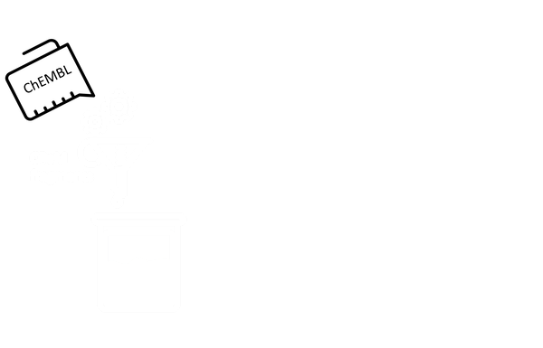

# CReM-dock: design of chemically reasonable compounds guided by molecular docking

This tool automates generation of molecules using CReM starting from a set of fragments by their growing within a protein binding site guided by molecular docking (EasyDock).



## Features
- fully automated workflow
- different selection strategies (greedy, Pareto, k-means clustering)
- different objective functions (docking score, docking score augmented with QED or the fraction of sp3-carbon atoms, docking score divided on the number of heavy atoms, etc)
- user-defined thresholds for maximum allowed physicochemical parameters (MW, logP, RTB, TPSA)
- using protein-ligand interaction fingerprints (ProLIF) and/or RMSD to a parent molecule to control the pose of a constructed ligand
- indirect control over synthetic feasibility of generated structures (based on CReM parameters)
- support docking programs integrated in EasyDock, including ligand preparation steps and distributed calculations
- output is SQLite database from which a user can retrieve all necessary information 
- continue interrupted/unfinished generation by rerun of the same command

## Installation

Install dependencies and the software
```
conda install -c conda-forge python=3.9 numpy rdkit dask distributed scipy scikit-learn prolif
pip install vina meeko easydock crem
pip install cremdock
```

## Generation pipeline

1. Docking of starting fragments.
2. (optional) Selection of molecules satisfying user-defined PLIF or RMSD to a parent molecule
3. Selection of the best candidates for the next iteration (greedy, Pareto, clustering) using the selected objective function (docking score, augmented docking score, etc)
4. Growing the selected molecules with CReM
5. Filtration of generated molecules by user-defined physicochemical parameters
6. Docking of passed molecules
7. Go to step 2  

Generation is stopped if no more molecules can be grown to satisfy the defined physicochemical parameters.

## Usage

### Modes
1. **Hit generation**. Generation of molecules which starts from a set of fragment supplied as SMILES or 2D SDF. In these case the supplied fragments are docked, pass PLIF/RMSD check (optional) and best candidates are used for growing on the next iteration.
2. **Hit expansion**. Expansion of a co-crystallized ligand by supplying 3D ligand structure (SDF). In this case an input molecule is directly going to the growing stage.


### Notes

Input SDF should not contain hydrogens or hydrogens should be listed after heavy atoms, otherwise protected ids can be broken and will not be correctly transferred to child molecules

## License
GPLv3

## Citation
CReM-dock: de novo design of synthetically feasible compounds guided by molecular docking  
Guzel Minibaeva, Pavel Polishchuk  
https://doi.org/10.26434/chemrxiv-2024-fpzqb-v2
